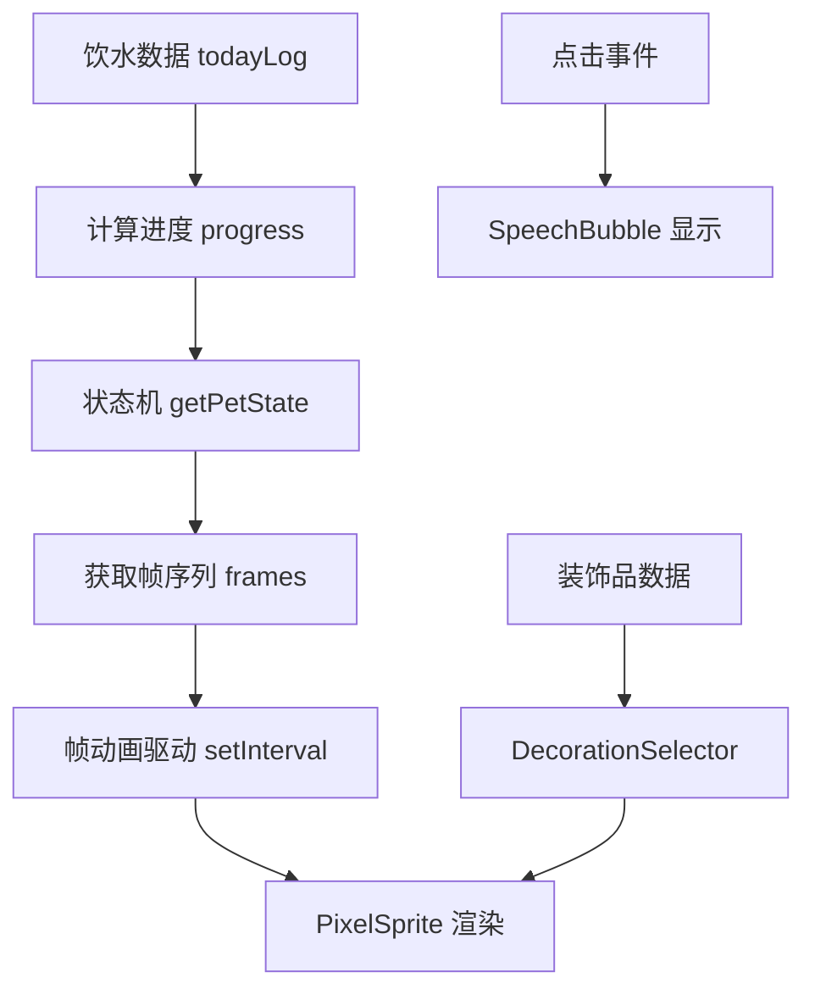

## 用户需求

用户要求对 WaterTracker 项目进行迭代规划，主要包含两个核心任务：

1. **像素风格优化**：当前小人动画并非严格意义上的像素风，需要优化为真正的像素格子渲染风格
2. **缺失功能补全**：深入探索项目中缺失的功能点，制定详细的补全方案

## 产品概述

WaterTracker 是一款移动端饮水追踪应用，采用 Expo + React Native + TypeScript 技术栈。当前版本已实现饮水记录、统计图表、提醒通知、久坐提醒、宠物系统等核心功能。项目采用深色主题设计（#1a1a2e、#2d2d44、#4FC3F7），数据通过 AsyncStorage 持久化存储。

## 核心功能分析

### 当前实现状态
- v1.0.0：饮水记录、进度圆环、周/月统计、定时提醒 ✓
- v1.1.0：久坐提醒功能 ✓
- v1.2.0：宠物系统基础版（但像素风格实现有偏差）✓
- v1.3.0：宠物等级系统、装饰品解锁 ✓

### 核心问题
当前 `PetCharacter.tsx` 使用圆形（Circle）、渐变等卡通风格元素，违背了像素风的设计原则。ROADMAP.md 第 8.3 节规划了真正的像素风格实现方案：使用二维数组描述像素图，每个像素点渲染为小正方形，通过调色盘系统管理颜色。

### 缺失功能点
1. **帧动画系统**：缺少精灵帧数据（spriteFrames.ts）和帧切换机制
2. **像素精灵渲染器**：缺少真正的像素格子渲染组件（PixelSprite.tsx）
3. **迷你游戏功能**：ROADMAP v1.3.0 规划但未实现
4. **装饰品选择器**：用户无法主动选择佩戴装饰品
5. **对话气泡组件**：缺少独立的 SpeechBubble 组件


## 技术栈

- **前端框架**：React Native + Expo SDK 55
- **开发语言**：TypeScript（strict mode）
- **图形渲染**：react-native-svg 15.15.3
- **数据持久化**：AsyncStorage
- **通知系统**：expo-notifications
- **导航**：@react-navigation/bottom-tabs

## 实现方案

### 像素风格重构策略

采用 ROADMAP.md 第 8.3 节规划的像素精灵渲染方案：

1. **像素数据结构**：使用二维数组描述精灵图，每个元素为颜色代码或 null（透明）
2. **调色盘系统**：用单字母代替颜色码，提高帧数据可读性
3. **逐点渲染**：遍历二维数组，对非 null 格子用 SVG Rect 绘制
4. **帧动画驱动**：使用 setInterval 驱动帧切换，组件卸载时清除定时器

**关键设计决策**：
- 像素单元大小：6x6（适配移动端屏幕）
- 帧切换间隔：200-400ms（根据状态调整）
- 精灵尺寸：16x24 像素格（小人主体）

### 架构设计

```
src/
├── components/
│   ├── PixelSprite.tsx      # [NEW] 像素精灵渲染器
│   ├── PetCharacter.tsx     # [MODIFY] 重构为使用 PixelSprite
│   ├── SpeechBubble.tsx     # [NEW] 独立对话气泡组件
│   └── DecorationSelector.tsx # [NEW] 装饰品选择器
├── utils/
│   ├── spriteFrames.ts      # [NEW] 精灵帧数据
│   ├── palette.ts           # [NEW] 调色盘定义
│   ├── petAnimations.ts     # [NEW] 帧动画控制器
│   └── miniGame.ts          # [NEW] 迷你游戏逻辑
└── screens/
    └── PetScreen.tsx        # [MODIFY] 集成新功能
```

### 数据流设计



## 目录结构

```
project-root/
├── src/
│   ├── components/
│   │   ├── PixelSprite.tsx           # [NEW] 像素精灵渲染器，接收帧数据和调色盘，逐点渲染像素格子
│   │   ├── PetCharacter.tsx          # [MODIFY] 重构为使用 PixelSprite，移除圆形/渐变元素，实现帧动画
│   │   ├── SpeechBubble.tsx          # [NEW] 独立对话气泡组件，支持淡入淡出动画和自动消失
│   │   ├── DecorationSelector.tsx    # [NEW] 装饰品选择器，分类展示已解锁装饰品，支持佩戴切换
│   │   ├── PixelScene.tsx            # [EXISTING] 像素风办公室背景，无需修改
│   │   ├── PetLottie.tsx             # [EXISTING] Lottie 占位符，可删除或保留
│   │   └── PetGrowthInfo.tsx         # [EXISTING] 宠物成长信息，无需修改
│   ├── utils/
│   │   ├── spriteFrames.ts           # [NEW] 所有精灵帧数据，包含 6 种状态的帧序列
│   │   ├── palette.ts                # [NEW] 调色盘定义，颜色代码映射表
│   │   ├── petAnimations.ts          # [NEW] 帧动画控制器，管理帧切换和状态过渡
│   │   ├── miniGame.ts               # [NEW] 迷你游戏逻辑，接水滴小游戏的碰撞检测和计分
│   │   ├── petState.ts               # [EXISTING] 状态机，无需修改
│   │   ├── decorations.ts            # [EXISTING] 装饰品定义，无需修改
│   │   └── petStorage.ts             # [EXISTING] 宠物数据存储，需扩展佩戴记录
│   ├── screens/
│   │   └── PetScreen.tsx             # [MODIFY] 集成帧动画、装饰品选择器、迷你游戏入口
│   └── types/
│       └── index.ts                  # [MODIFY] 新增 DecorationSlot、MiniGameScore 类型
```

## 实现要点

### 性能优化
- 像素渲染使用 `key` 属性避免不必要的重绘
- 帧动画使用 `useRef` 保存帧索引，避免闭包陷阱
- 装饰品选择器使用虚拟列表（解锁数量 > 20 时）

### 向后兼容
- 保留现有 `PetCharacter` 的 props 接口
- 新增 `usePixelMode` 参数控制渲染模式（过渡期）
- 装饰品佩戴数据存储在 `PetData.selectedDecorations` 字段

### 错误处理
- 帧数据缺失时回退到默认帧
- 调色盘颜色无效时使用回退色 #ff00ff（品红）
- 游戏组件加载失败时显示占位 UI


## 设计风格

采用 **复古像素风格**，致敬 8-bit 游戏时代的美学特征。整体设计强调像素格子的颗粒感、有限调色盘的复古色彩、以及帧动画的流畅切换。

### 视觉特征
- **像素格子**：所有图形由 6x6 的正方形像素格子构成，边缘清晰锐利
- **有限调色盘**：使用 16 色以内的调色盘，避免渐变和半透明效果
- **帧动画**：每个状态 2-4 帧循环，帧切换间隔 200-400ms
- **CRT 扫描线**：可选的复古 CRT 显示效果（半透明横纹叠加）

### 场景设计
- 像素风办公室背景已实现（PixelScene.tsx）
- 小人主体尺寸：16x24 像素格（约 96x144 物理像素）
- 装饰品叠加层：帽子、光环、轨迹等独立渲染

### 交互设计
- 点击小人：触发对话气泡，显示随机台词
- 长按小人：进入装饰品选择模式
- 滑动屏幕：小人跟随移动（可选功能）
- 双击屏幕：触发迷你游戏（可选功能）

## Agent Extensions

### Skill
- **ui-ux-pro-max**
  - Purpose: 优化像素风格 UI 设计，确保视觉效果符合 8
